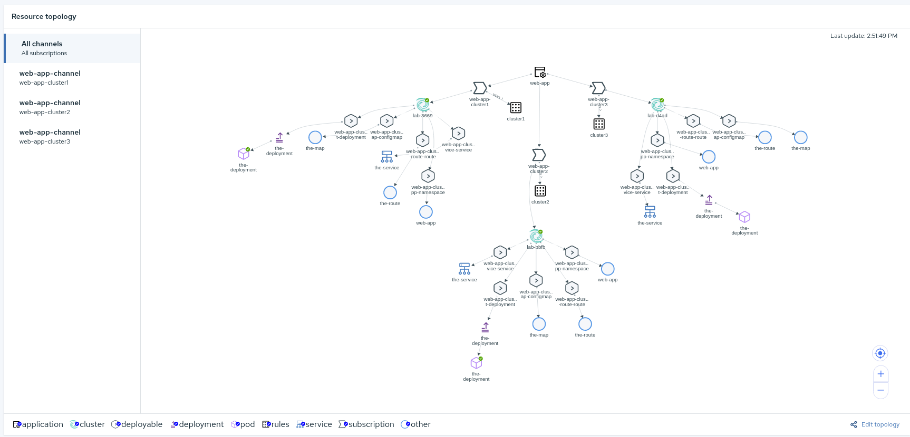

# Customizing deployments
Certain situations exist especially in multicluster scenarios and in development workflows where an application requires specific values to be unique for that environment.
*Kustomize* was created to handle that specific situation and as of Kubernetes 1.14 the functionality is integrated into `kubectl`.

## Creating a Kustomized App
This lab is going to walk through the details of deploying a project and resources that use the same YAML files but are unique per cluster based on values provided by *Kustomize*.

The [lab-5-assets](lab-5-assets/base) contains definitions to deploy these resources.

The assets will be loaded into RHACM to be deployed and managed but each cluster will have unique values used by the configmap, deployment, and service.

## Kustomize Overlays
*Kustomize* offers the ability to create [overlays](https://github.com/kubernetes-sigs/kustomize/blob/master/docs/glossary.md#overlay). These are directories with subdirectories below that contain specific changes.

We will use *Kustomize* to deploy the same resources in our 3 clusters but the configmap will be different per cluster. We will also specify different amounts of `replicas` to be deployed per cluster.

First, we need to modify the Route hostnames that will be used by our clusters.

Change directory to `lab-5-assets` to see the assets to be created.
~~~sh
cd rhacmgitopslab/lab-5-assets
~~~

Modify the route hostname for the application
~~~sh
cp overlays/cluster1/route.yaml.backup overlays/cluster1/route.yaml
cp overlays/cluster2/route.yaml.backup overlays/cluster2/route.yaml
cp overlays/cluster3/route.yaml.backup overlays/cluster3/route.yaml

# Define the variable of `ROUTE_CLUSTER1`
ROUTE_CLUSTER1=web-app.$(oc --context=cluster1 get ingresses.config.openshift.io cluster -o jsonpath='{ .spec.domain }')
# Define the variable of `ROUTE_CLUSTER2`
ROUTE_CLUSTER2=web-app.$(oc --context=cluster2 get ingresses.config.openshift.io cluster -o jsonpath='{ .spec.domain }')
# Define the variable of `ROUTE_CLUSTER3`
ROUTE_CLUSTER3=web-app.$(oc --context=cluster3 get ingresses.config.openshift.io cluster -o jsonpath='{ .spec.domain }')
# Replace the value of changeme with `ROUTE_CLUSTER1` in the file `route.yaml`
sed -i "s/changeme/${ROUTE_CLUSTER1}/" overlays/cluster1/route.yaml
# Replace the value of changeme with `ROUTE_CLUSTER2` in the file `route.yaml`
sed -i "s/changeme/${ROUTE_CLUSTER2}/" overlays/cluster2/route.yaml
# Replace the value of changeme with `ROUTE_CLUSTER3` in the file `route.yaml`
sed -i "s/changeme/${ROUTE_CLUSTER3}/" overlays/cluster3/route.yaml
~~~

Before committing our changes we need to update also the main Github repository in the file describe the "Channel" resource:
~~~sh
sed -i 's/ansonmez/YOUR_GITHUB_USERNAME/g' rhacmgitopslab/lab-5-acm/02_channel.yaml
~~~

We are going to commit our changes, because we'll need them for our GitOps deployment model.

~~~sh
# Stage your changes to be sent to the git repository
git commit -am 'Route Hostname configured for all three clusters'
# Push your commits to the git repository
git push origin master
~~~

Within the directory [overlay-assets](./lab-5-assets/overlay-assets/overlays) you will find three directories, one per cluster. These directories contain a unique configmap, deployment and route file with the specific modifications for each cluster. You will use these files to define any customization.

For example, in cluster1 we will have 1 replica while cluster 3 will have 3 replicas. Below you will see the customizations for cluster3.

The ConfigMap will tell you which cluster the application is running in.

~~~yaml
apiVersion: v1
kind: ConfigMap
metadata:
  name: the-map
data:
  altGreeting: "The app is running on cluster3"
~~~

The deployment file will override the amount of replicas in the original `deployment.yaml` with the value defined within the overlay directory.

~~~yaml
apiVersion: apps/v1
kind: Deployment
metadata:
  name: the-deployment
spec:
  replicas: 3
~~~

If your organization also wanted to do canary deployments. The image could be changed within the *kustomize.yaml* file, an example can be found [here](https://github.com/kubernetes-sigs/kustomize/tree/master/examples/transformerconfigs#images-transformer)

1- Change the directory lab-5-acm
~~~sh
cd rhacmgitopslab/lab-5-acm/
~~~

2- Ensure to load the "hubcluster" context
~~~sh
oc config use-context hubcluster
~~~

3- Create namespace
~~~sh
oc create -f 01_namespace.yaml
~~~

4- Create channel
~~~sh
oc create -f 02_channel.yaml
~~~

5- Create application
~~~sh
oc create -f 03_application_webapp.yaml
~~~

6- Create placementrule for  each cluster
Be sure your clusters are labeled in RHACM. clusterid: cluster1, clusterid: cluster2, clusterid: cluster3
~~~sh
oc describe clusters -A
.....
...
Name:         jelly
Namespace:    jelly
Labels:       city=ankara
              cloud=Other
              clusterid=cluster2
              name=jelly
              vendor=OpenShift
      
~~~
Create placment rules
~~~sh
oc create -f 04_placement_cluster1.yaml
oc create -f 04_placement_cluster2.yaml
oc create -f 04_placement_cluster3.yaml
~~~

7- Create subscription
~~~sh
oc create -f 05_subscription_cluster1.yaml
oc create -f 05_subscription_cluster2.yaml
oc create -f 05_subscription_cluster3.yaml
~~~

Verify the deployments have been created on all the clusters.

~~~sh
# The for loop below will show the status of the deployment on the three clusters
for cluster in cluster1 cluster2 cluster3; do
    echo ------------ ${cluster} deployments ------------
    oc --context ${cluster} -n web-app get deployments
done
~~~

~~~sh
# The for loop below will get the `OpenShift Route` and then curl the application
for cluster in cluster1 cluster2 cluster3; do
  echo ------------ ${cluster} app ------------
  url=$(oc --context ${cluster} -n web-app get route the-route -o jsonpath='{.spec.host}')
  curl http://$url
done
~~~

Connecting to RHACM WebUI you should see a topology like this:

[Home](README.md)
